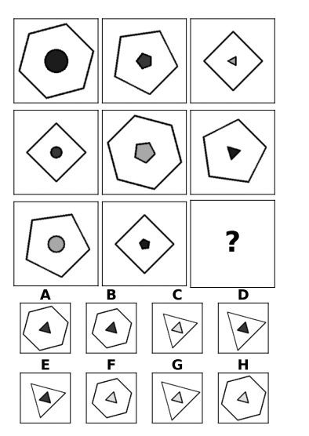

# abstract-visual-reasoning-vit
Evaluate and improve performance of Vision Transformer and BEiT on the Raven's Progressive Matrices IQ test.

## Introduction

The Raven's Progressive Matrices is a non-verbal IQ test used to measure human intelligence and abstract visual reasoning. Each instance (problem) of the test consists of a 3x3 grid of images with one missing image. The goal is to select the correct image from a set of 8 options to complete the grid. See image below for an example.

The [I-RAVEN](https://github.com/husheng12345/SRAN) is a robust dataset for evaluating neural networks on the RPM test. When this project was started, there was very limited work on evaluating and improving pretrained transformer models on the I-RAVEN dataset. In this project, we use the pretrained [Vision Transformer (ViT)](https://github.com/google-research/vision_transformer) and [BEiT](https://github.com/microsoft/unilm/tree/master/beit) checkpoints as backbones, with [Scattering Compositional Learner](https://github.com/lucidrains/scattering-compositional-learner) and MLP classifier heads to evaluate and improve performance on the I-RAVEN dataset.
